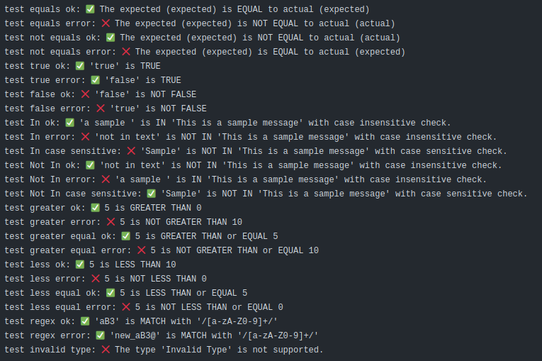

<div align="center">
  <h1>Assert GitHub Action</h1>
  <br />
  <a href="#getting-started"><strong>Getting Started »</strong></a>
  <br />
  <br />
  <a href="https://github.com/Payadel/assert/issues/new?assignees=&labels=bug&template=BUG_REPORT.md&title=bug%3A+">Report a Bug</a>
  ·
  <a href="https://github.com/Payadel/assert/issues/new?assignees=&labels=enhancement&template=FEATURE_REQUEST.md&title=feat%3A+">Request a Feature</a>
  .
  <a href="https://github.com/Payadel/assert/issues/new?assignees=&labels=question&template=SUPPORT_QUESTION.md&title=support%3A+">Ask a Question</a>
</div>

<div align="center">
<br />

[](https://github.com/Payadel)


[](https://github.com/Payadel/assert/issues?q=is%3Aissue+is%3Aopen+label%3A%22help+wanted%22)
</div>

## About

**Assert** is a TypeScript-based GitHub Action that provides a simple and effective way to assert variables. It is ideal
for use in CI/CD pipelines and can be used to ensure that outputs from previous steps meet expected values.

### Demo



## Getting Started

## Usage

To use Assert GitHub Action in your workflow, simply add the following step to your `.yml` file:

```yaml
- name: Test Results
  uses: Payadel/assert@v1
  with:
    fail-fast: false
    verbose: true
    inputs: |
      # assertions

```

If `fail-fast` is set to `false`, all tests will be executed even if a test fails.

If `verbose` is `true`, all messages (including successful tests) will be displayed.

The `inputs` parameter should contain a list of assertion objects that you wish to perform.

An assertion object consists of the following properties:

- **name:** A descriptive name for the assertion.
- **type:** The type of assertion to perform. Valid types
  include `Equals`, `Not-Equals`, `True`, `False`, `In`, `Not-In`, `Greater`, `Greater-Equal`, `Less`, `Less-Equal`,
  and `Regex`. (The capitalization of the letters is not important.)
- Other parameters: It depends on the `type`, which will be explained below.

### Type: Equals and Not-Equals

- **expected:** The expected value for the assertion.
- **actual:** The actual value to be tested.

#### Sample

```yaml
    inputs: |
      - name: test equality
        type: Equals
        expected: 'valid value'
        actual: ${{ steps.prev_step_id.outputs.variable }}
```

### Type: True and False

- **input:** The value to be tested.

#### Sample

```yaml
    inputs: |
      - name: test True
        type: True
        input: ${{ steps.prev_step_id.outputs.success }}
```

### Type: In and Not-In

- **member:** The value to search for.
- **container:** The string to search within.
- **case_sensitive (boolean):** Is the search case-sensitive or not? (default is `false`)

#### Sample

```yaml
    inputs: |
      - name: test In
        type: In
        member: 'World'
        container: ${{ steps.prev_step_id.outputs.message }}
        case_sensitive: true
```

### Type: Greater

- **target (number):** The number to be checked.
- **greater_than (number):** The value to compare against for Greater assertions.

#### Sample

```yaml
    inputs: |
      - name: test Greater
        type: Greater
        greater_than: 1
        target: ${{ steps.prev_step_id.outputs.number }}
```

### Type: Greater-Equal

- **target (number):** The number to be checked.
- **greater_equal:** The value to compare against for Greater-Equal assertions.

#### Sample

```yaml
    inputs: |
      - name: test Greater or Equal
        type: Greater-Equal
        greater_equal: 1
        target: ${{ steps.prev_step_id.outputs.number }}
```

### Type: Less

- **target (number):** The number to be checked.
- **less_than (number):** The value to compare against for Less assertions.

#### Sample

```yaml
    inputs: |
      - name: test Less
        type: Less
        less_than: 100
        target: ${{ steps.prev_step_id.outputs.number }}
```

### Type: Less-Equal

- **target (number):** The number to be checked.
- **less_equal (number):** The value to compare against for Less-Equal assertions.

#### Sample

```yaml
    inputs: |
      - name: test Less Equal
        type: Less-Equal
        less_equal: 100
        target: ${{ steps.prev_step_id.outputs.number }}
```

### Type: Regex

- **regex:** The regular expression to match against for Regex assertions.
- **text:** The text to be checked.

#### Sample

```yaml
    inputs: |
      - name: test regex
        type: Regex
        regex: '[0-9]+'
        text: ${{ steps.prev_step_id.outputs.number }}
```

## CHANGELOG

Please read the [CHANGELOG.md](CHANGELOG.md)

## Features

- Provides assertions for various types of comparisons,
  including `Equals`, `Not-Equals`, `True`, `False`, `In`, `Not-In`, `Greater`, `Greater-Equal`, `Less`, `Less-Equal`,
  and `Regex`.

- Customizable to include `verbose` output for each assertion, providing detailed information about the expected and
  actual results.

- Supports `fail-fast` behavior, which stops the entire workflow as soon as an assertion fails.

- Written in TypeScript and thoroughly (100%) tested, ensuring reliable performance and accurate results.

- Easy to integrate into GitHub Actions workflows with a simple and intuitive syntax.

With these features, assert makes it easy to ensure that variables in your GitHub Actions workflows meet the expected
criteria, reducing the likelihood of errors and ensuring that your workflows run smoothly.

## Roadmap

See the [open issues](https://github.com/Payadel/assert/issues) for a list of proposed features (and known
issues).

- [Top Feature Requests](https://github.com/Payadel/assert/issues?q=label%3Aenhancement+is%3Aopen+sort%3Areactions-%2B1-desc) (
  Add your votes using the 👍 reaction)
- [Top Bugs](https://github.com/Payadel/assert/issues?q=is%3Aissue+is%3Aopen+label%3Abug+sort%3Areactions-%2B1-desc) (
  Add your votes using the 👍 reaction)
- [Newest Bugs](https://github.com/Payadel/assert/issues?q=is%3Aopen+is%3Aissue+label%3Abug)

## Support

Reach out to the maintainer at one of the following places:

- [GitHub issues](https://github.com/Payadel/assert/issues/new?assignees=&labels=question&template=SUPPORT_QUESTION.md&title=support%3A+)

## FAQ

#### What is assert?

assert is a GitHub Action that provides a set of assertions to compare different values in your GitHub Actions
workflows. It allows you to verify that a value is equal to an expected value, is contained in a certain set of values,
or matches a specific pattern, among other types of comparisons.

#### How does assert work?

assert is integrated into your GitHub Actions workflow as a step. When executed, it compares the value of a given input
against the expected output specified in the action's parameters. If the comparison fails, the action will output an
error message indicating which assertion failed and what the expected and actual values were.

#### How do I integrate assert into my workflow?

To use assert, you can add a step to your workflow that uses the `Payadel/assert` action, and provide the appropriate
parameters for the desired assertions. You can customize the output behavior of the action to include detailed
information about the expected and actual values, and configure it to `fail-fast`, stopping the entire workflow if an
assertion fails.

#### What types of comparisons can assert perform?

assert provides a variety of assertion types,
including `Equals`, `Not-Equals`, `True`, `False`, `In`, `Not-In`, `Greater`, `Greater-Equal`, `Less`, `Less-Equal`,
and `Regex`. These assertions can be used to compare different types of values, such as strings, numbers, and booleans,
and check for specific patterns or values.

#### Is assert reliable and safe to use?

**Yes,** assert is a reliable and safe GitHub Action that has been thoroughly tested and written in TypeScript. Its
assertions are designed to be accurate and precise, ensuring that your workflows run smoothly and without errors.
However, as with any tool, it's important to use assert appropriately and validate its behavior to ensure that it meets
your requirements.

## Project assistance

If you want to say **thank you** or/and support active development of `Assert`:

- Add a [GitHub Star](https://github.com/Payadel/assert) to the project.
- Tweet about the `Assert`.
- Write interesting articles about the project on [Dev.to](https://dev.to/), [Medium](https://medium.com/) or your
  personal blog.

Together, we can make `Assert` **better**!

## Contributing

First off, thanks for taking the time to contribute! Contributions are what make the free/open-source community such an
amazing place to learn, inspire, and create. Any contributions you make will benefit everybody else and are **greatly
appreciated**.

Please read [our contribution guidelines](docs/CONTRIBUTING.md), and thank you for being involved!

## Authors & contributors

The original setup of this repository is by [Payadel](https://github.com/Payadel).

For a full list of all authors and contributors,
see [the contributors page](https://github.com/Payadel/assert/contributors).

## Security

`Assert` follows good practices of security, but 100% security cannot be assured. `Assert` is provided **"as
is"** without any **warranty**.

_For more information and to report security issues, please refer to our [security documentation](docs/SECURITY.md)._

## License

This project is licensed under the **GPLv3**.

See [LICENSE](LICENSE) for more information.
